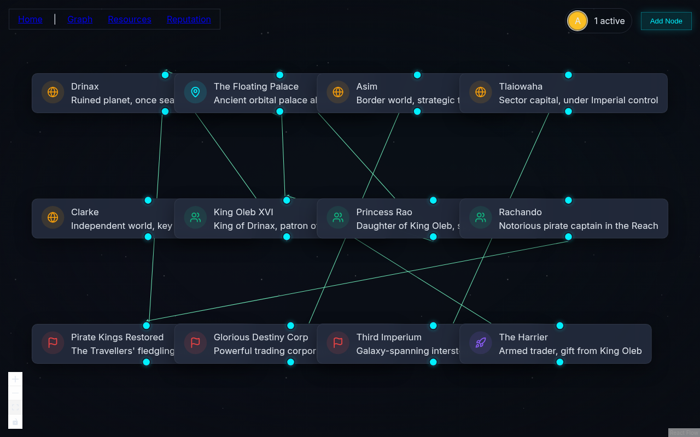
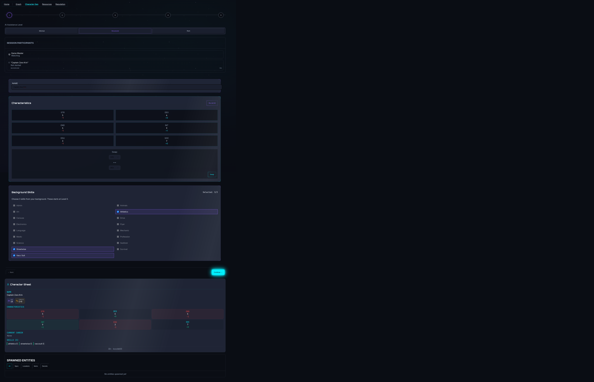
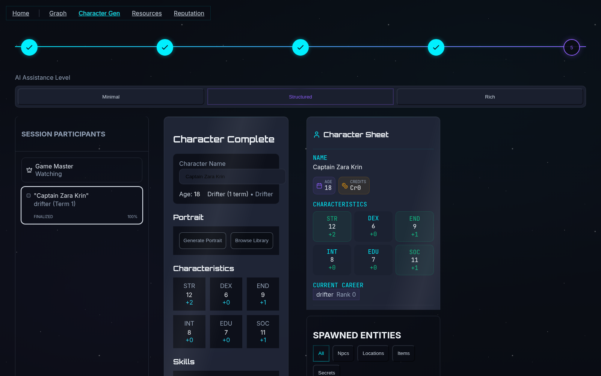
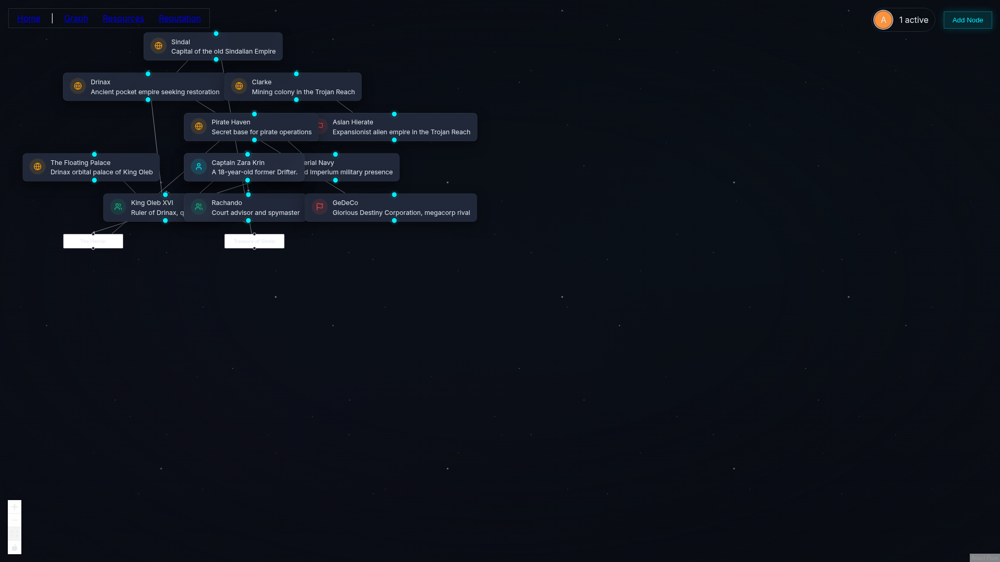

# Highport

> The bridge of your campaign. Real-time. Open-source. Extensible.

[](LICENSE)
[](https://www.typescriptlang.org/)
[]()
[](https://github.com/sponsors/EZotoff)

---



### Screenshots

<table>
  <tr>
    <td></td>
    <td></td>
    <td></td>
  </tr>
  <tr>
    <td align="center"><b>Character Creation</b></td>
    <td align="center"><b>Character Sheet</b></td>
    <td align="center"><b>Campaign Graph</b></td>
  </tr>
</table>

## Features

- 🎮 **Real-time Collaboration** — Multiple users edit simultaneously with Yjs CRDT sync
- 🤖 **AI-powered Research** — Ask questions about your campaign lore with knowledge gating
- 🕸️ **Graph Visualization** — Interactive node graph for NPCs, locations, factions, and their relationships
- 📊 **Campaign Management** — Create, manage, and organize your TTRPG campaigns
- 💾 **Offline Support** — IndexedDB persistence works even when disconnected
- 🔌 **Extensible Game Data** — Plugin import system with starter content included

---

## Quick Start

```bash
# 1. Clone the repository
git clone https://github.com/ezotoff/highport.git
cd highport

# 2. Install dependencies
pnpm install

# 3. Start PostgreSQL
docker compose up -d

# 4. Run database migrations
pnpm --filter server db:migrate

# 5. Start development servers
pnpm dev
```

The web app is now running at `http://localhost:3010`.

---

## AI Setup

To enable the "Ask Computer" AI assistant, you'll need the RAG service running. The fastest path uses free local providers (Ollama + ChromaDB) with no API keys required.

See the complete setup guide: [docs/rag-setup.md](./docs/rag-setup.md)

---

## Architecture

Highport uses a real-time CRDT sync engine powered by Yjs and Hocuspocus:

```
┌─────────────┐     WebSocket      ┌─────────────┐     SQL       ┌─────────────┐
│   Web App   │ ◄────────────────► │  Hocuspocus │ ◄───────────► │  PostgreSQL │
│  (Next.js)  │      Port 3011     │   Server    │               │   Port 5432 │
│   Port 3010 │                    │   Port 3012 │               │             │
└──────┬──────┘                    └─────────────┘               └─────────────┘
       │
       │ HTTP/SSE
       ▼
┌─────────────┐
│    RAG      │     LLM        ┌─────────────┐
│  Service    │ ◄────────────► │   Ollama    │
│  Port 8000  │   (local)      │  Port 11434 │
└─────────────┘                └─────────────┘
```

- **Web** (3010): Next.js 14 frontend with React Flow graph visualization
- **Hocuspocus** (3011): Yjs WebSocket server for real-time sync
- **Fastify** (3012): REST API for campaigns and user management
- **RAG Service** (8000): Python FastAPI for AI queries with knowledge gating
- **PostgreSQL** (5432): Document persistence and user data

---

## Game Data

Highport supports custom game system data through a plugin import system. Place JSON files in the data import folder, and the system will load your custom content.

**Starter Content**: A basic "Drifter" career and core skill list are included so you can start exploring immediately. For a full game system experience (additional careers, equipment tables, etc.), install a compatible game data pack.

---

## Contributing

We welcome contributions. See [CONTRIBUTING.md](./CONTRIBUTING.md) for setup instructions, branch naming conventions, and our pull request process.

Look for issues labeled `good first issue` to get started.

---

## Roadmap

See [ROADMAP.md](./ROADMAP.md) for what is shipping now, what is coming next, and our long-term vision. Foundry VTT integration is planned for a future release.

Community input welcome. Open a GitHub Issue with the `feature-request` label to share what matters most to you.

---

## Services

| Service     | Port | Description           |
| ----------- | ---- | --------------------- |
| Web         | 3010 | Next.js frontend      |
| Hocuspocus  | 3011 | WebSocket sync server |
| Fastify     | 3012 | REST API              |
| RAG Service | 8000 | Python FastAPI for AI |
| PostgreSQL  | 5432 | Database              |

---

## License

This project is licensed under the [MIT License](./LICENSE).
